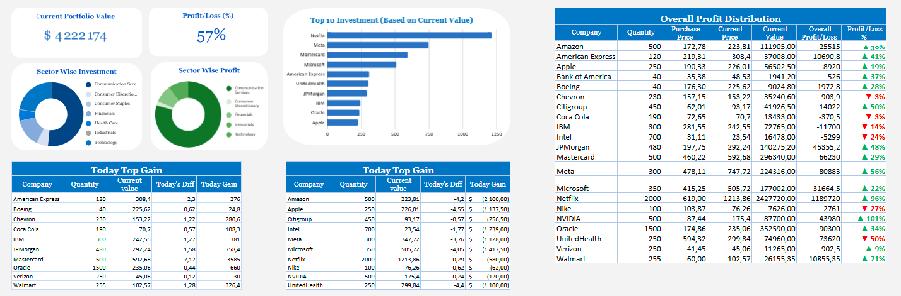

# Stock Portfolio Dashboard (Excel)
A complete, step-by-step data analyst case study that turns stock price data extracted from **Yahoo Finance** via **Google Sheets** into a polished Excel dashboard for tracking portfolio performance, sector exposure, and daily movers.

**Goal**: Provide a reproducible blueprint that anyone can clone, open in Excel, refresh, and immediately see their portfolio KPIs.
---

## Business Problem
Investors often need a clean way to track portfolio performance and stock movements.

The dashboard answers key questions:
- What is my current portfolio value?
- What is my overall profit/loss and % return?
- Which sectors drive my exposure and profit?
- Who are today’s top gainers/losers?
- Where are wins/losses concentrated?

## What you’ll find in this repo

**`data`** — example Google Sheets exports containing data from Yahoo Finance.

**`excel/Portfolio_Dashboard.xlsx`** — the finished dashboard workbook.

**`dashboard.png`** — dashboard screenshot used in this README.

You can replace the sample exports with your own and press Data ▸ Refresh All in Excel.

## Data Source

All stock prices and company details were fetched from **Yahoo Finance** using **Google Sheets** functions and then exported to Excel.

**1.** Search for a company.

**2.** Go to Historical Data.

**3.** Choose a date range.

**4.** Click Download CSV.

## Data Model
|Coloumn Name|Type|Description|
|-----------|---------|---------|
|Company|Text|Company Name|
|Qty|Number|Number of Shares Purchased|
|Purchase Price|Number|Price Per Share at The Time of purchase|
|Investment|Number|Total Investment Amount Per Company|
|Purchase Date|Date|The Date Of Stock Purchase|
|Current Price|Number|Latest Stock Price from Yahoo Finance|
|Prev Price|Number|Previous Closing Price|
|Today's Diff|Number|Difference between Current and Previous Price|
|Prev Value|Number|Previous day’s portfolio value|
|Current Value|Number|Current Portfolio Value|
|Today Gain|Number|Profit/loss for the day|
|Overall Profit/Loss|Number|Total profit or loss|
|Profit/Loss %|Percentage|Percentage gain/loss|
|Sector|Text|Sector classification of the company|

## Metric definitions

- Investment = **`Qty * Purchase Price`**

- Current Value = **`Qty * Current Price`**

- Prev Value = **`Qty * Prev Price`**

- Today's Diff =**` Current Price − Prev Price`**

- Today Gain = **`Qty * Today's Diff`**

- Overall Profit/Loss = **`Current Value − Investment`**

- Profit/Loss % = **`Overall Profit/Loss ÷ Investment`**

- Portfolio Value = **`Σ Current Value`**

- Portfolio Profit/Loss % = **`Σ Overall P/L ÷ Σ Investment`**

## Dashboard features
*Dashboard Preview:*  

**- Portfolio KPIs →** Total Investment, Current Value, Profit/Loss, P/L %

**- Top Gainers & Losers →** Based on Today’s Diff and Today Gain

**- Sector Analysis →** Allocation and performance per sector

**- Profit Distribution →** Visualizes P/L across companies

**- Dynamic Indicators →** Color-coded P/L and arrows for positive/negative trends

---

## How to update with new data

**1.** Download updated CSVs from Yahoo Finance.

**2.** Import them into Google Sheets and clean if needed.

**3.** Export to Excel and replace old data.

**4.** Open Portfolio_Dashboard.xlsx → **Refresh All.**

**5.** Dashboard updates automatically.

